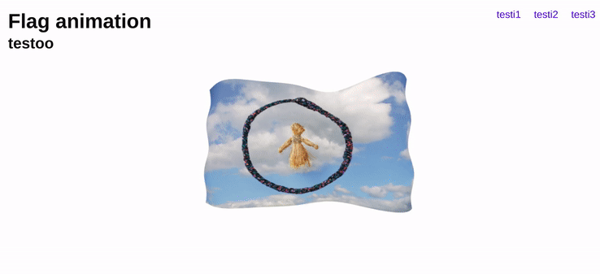

# 3d WAVING FLAG using Three.js, WebGL and Javascript

## THIS TUTORIAL was created by "SUPERHI" :ant:

<br>

#### The following data comes from the three.js official page

> https://threejs.org/docs/index.html#manual/en/introduction/Creating-a-scene

<br>

### INSTALLATION A

- DOWNLOAD the zip and open it inside the folder of your three flag project
- then unzip it and grab the three.min.js that is inside the build folder
- COPY and paste it in the root folder "your current three project"
- then import it: <script src="three.min.js"></script>
- if the installation plus the importing, plus the data here below worked,you will have a black page on the bottom
- that is the scene

<br>

### ADD the html

```javascript
<!DOCTYPE html>
<html lang="en">
  <head>
    <meta charset="UTF-8" />
    <meta name="viewport" content="width=device-width, initial-scale=1.0" />
    <link rel="stylesheet" href="./style.css" />
    <title>Flag animation three.js</title>
  </head>
  <body>
    <header>
      <h1>Flag animation</h1>
      <h2>testoo</h2>
    </header>
    // <!-- -------------- -->
    <nav>
      <a href="#">testi1</a>
      <a href="#">testi2</a>
      <a href="#">testi3</a>
    </nav>

    <!-- -------  section  -->

    <section class="flag"></section>
    <!-- -------  section  -->
    <script src="three.min.js"></script>
    <script src="flag.js"></script>
  </body>
</html>
```

<br>

### ADD THE flag.js

#### STEP 1 and 2 of the flag.js

###### THE DEFAULT DATA inside the flag.js

```javascript
// 1 CREATE the scene
// all this data comes from the documentation
// https://threejs.org/docs/index.html#manual/en/introduction/Creating-a-scene
//
//
const scene = new THREE.Scene();
const camera = new THREE.PerspectiveCamera(
  75,
  window.innerWidth / window.innerHeight,
  0.1,
  1000
);

const renderer = new THREE.WebGLRenderer();
renderer.setSize(window.innerWidth, window.innerHeight);
document.body.appendChild(renderer.domElement);

/*
--------------------


Last but not least, we add the renderer element to our HTML document. 

This is a <canvas> element the renderer uses to display the scene to us.
"That's all good, but where's that cube you promised?" Let's add it now.

--------------------


*/

// 2 --------------------   geometry related
const geometry = new THREE.BoxGeometry();
const material = new THREE.MeshBasicMaterial({ color: 0x00ff00 });
const cube = new THREE.Mesh(geometry, material);
scene.add(cube);

camera.position.z = 5;
```

<br>
<br>

<!-- IMAGE BLACK CUBE    ******   -->

<br>

### STEP 3

#### Rendering the scene

- If you copied the code from above into the HTML file we created earlier, you wouldn't be able to see anything. This is because we're not actually rendering anything yet. For that, we need what's called a render or animate loop.

```javascript
//
// 3 --------------------  Rendering the scene
//
function animate() {
  requestAnimationFrame(animate);
  renderer.render(scene, camera);
}
animate();
```

<!-- IMAGE BLACK CUBE WITH GREEN CUBE INSIDE  -->

<br>

### STEP 4

##### ANIMATE THE CUBE

- ADD THE following inside the step 3

> cube.rotation.x += 0.01;
> cube.rotation.y += 0.01;

- Like so:

```javascript
// If you insert all the code above into the file you created before we began, you should see a green box. Let's make it all a little more interesting by rotating it.

// Add the following right above the renderer.render call in your animate function:

function animate() {
  //
  // C ANIMATE THE CUBE
  cube.rotation.x += 0.01;
  cube.rotation.y += 0.01;

  //
  requestAnimationFrame(animate);
  renderer.render(scene, camera);
}
animate();
```

<!-- ANIMATION GIF -->

#### AT THIS POINT

- The animation is positioned after the section flag, and we want to position it inside the section flag

```javascript
//    <!-- -------  section  -->

<section class="flag">FLAG goes here</section>
//  **** THE FLAG is actually here and we need to move it inside the flag section

// <!-- -------  section  -->
```

#### SO the next step will be to add the cube to the section tag

- GO right on the top of the flag.js and type the following

```javascript
const section = document.querySelector("section.flag");
```

- NOW that you have selected the section.flag from the css that is connected to the section inside the html, you can use it here in this part
  of the code

````javascript
// REPLACE this
document.body.appendChild(renderer.domElement);
// For this
section.appendChild(renderer.domElement);```
````

### At This point the cube is now inside the SECTION.FLAG

#### NOW we are going to add something called "ALPHA"

> ALPHA: whter the canvas contains an alpha (transparency) buffer or not. Default is false.

- You will add that to the renderer, like so

```javascript
// OPEN curly brackets inside the:  THREE.WebGLRenderer();  and add the alpha
const renderer = new THREE.WebGLRenderer({
  alpha: true,
  antialias: true, // this will smooth the edges of the cube
});
```

##### After that you will notice its not longer black

### NOW CHANGE the shape

- start by the color

```javascript
const material = new THREE.MeshBasicMaterial({
  // leave this  0x
  // and add a random color like f0f but without the hash #
  color: 0xff0000,
});
```

#### CHANGING FROM A BOX TO A FLAG

- CHECK THE DOCUMENTATION inside of Geometries

- There you will find a range of options starting with "BoxGeometry" , cylinder etc etc

```javascript
Geometries;
BoxBufferGeometry;
BoxGeometry;
CircleBufferGeometry;
CircleGeometry;
ConeBufferGeometry;
ConeGeometry;
CylinderBufferGeometry;
CylinderGeometry;
DodecahedronBufferGeometry;
DodecahedronGeometry;
EdgesGeometry;
ExtrudeBufferGeometry;
ExtrudeGeometry;
IcosahedronBufferGeometry;
IcosahedronGeometry;
LatheBufferGeometry;
LatheGeometry;
OctahedronBufferGeometry;
OctahedronGeometry;
ParametricBufferGeometry;
ParametricGeometry;
PlaneBufferGeometry;
PlaneGeometry;
PolyhedronBufferGeometry;
PolyhedronGeometry;
RingBufferGeometry;
RingGeometry;
ShapeBufferGeometry;
ShapeGeometry;
SphereBufferGeometry;
SphereGeometry;
TetrahedronBufferGeometry;
TetrahedronGeometry;
TextBufferGeometry;
TextGeometry;
TorusBufferGeometry;
TorusGeometry;
TorusKnotBufferGeometry;
TorusKnotGeometry;
TubeBufferGeometry;
TubeGeometry;
WireframeGeometry;
```

#### PICK the "PlaneGeometry"

```javascript
// replace this
const geometry = new THREE.BoxGeometry();

// for this
const geometry = new THREE.PlaneGeometry();
```

##### NOW CHANGE THE SIZE

```javascript
// THREE.PlaneGeometry(5, 3); the 5 stands for width and 3 for height
const geometry = new THREE.PlaneGeometry(5, 3);
```

##### THE WAVES part 1

- Right now we cannot tell where the points in the flag are but we can do the following
  inside the MESH, after the color.

  - You have to increise the points from where you are going to grab it, its like in 3ds max or photoshop when you play with the dots in the mesh

```javascript
const geometry = new THREE.PlaneGeometry(5, 3, 15, 9);
// const geometry = new THREE.PlaneGeometry(5, 3, 15, 9);
// 15 is 5 times 3 and 9 is 3 times 9
```

##### THE WAVES part 2

- Making the waves using the points in the geometry

- start by stoping the rotation of the flag, remove this:

```javascript
// hide it
cube.rotation.x += 0.01;
cube.rotation.y += 0.01;
```

##### There are 3 ways you can change the rotation

```javascript
//
// new rotation
cube.rotation.set(-0.1, 0, 0);
// cube.rotation.set(0, 0, 0);
// x direction y axe and z
```

##### To move the flag in some sort of "SINE WAVE" grab dots/vertices

```javascript
// the map is there to grab the dots
//  so its going to map every single point and do somethingfunction animate() {
cube.geometry.vertices.map((dots_vertices) => {
  // in which direction we want the dots moving?
  // up and down closer to the user
  // so change the vertices
  //
  //

  //c dots_vertices.z = Math.sin(dots_vertices.x) //with this you have huge curve
  // d here you control the size of the wave 0.5 * Math , you can add 2 to test 2 * Math
  // dots_vertices.z = 0.5 * Math.sin(dots_vertices.x);
  //
  // sin(dots_vertices.x * 2); here the 2 makes reference to how many waves in the flag
  // but the more waves you have the more segments you need , change it here:
  // const geometry = new THREE.PlaneGeometry(5, 3, 50, 30);
  dots_vertices.z = 0.5 * Math.sin(dots_vertices.x * 2);

  //
  //b dots_vertices.z = 0;
  //
  //
  //a  dots_vertices.z = -1;
  // the z is related to this: camera.position.z = 5;

  //   dots_vertices.z = 4; will zoom/increase towards the user
});
```

<br>
<br>

##### Now we can change it based on time

- The time is going to wave the flag smoothly

```javascript
//
//
camera.position.z = 5;

//
// new rotation
cube.rotation.set(-0.1, 0, 0);
// x direction y direction and z
//
// this will increase the flag, actually is like zooming, the less the bigger
camera.position.z = 4;
//
//
//by default its not doing anything, however inside the animate function you will be using it
// its going to wave the flag smoothly too due to the
const clock = new THREE.Clock();
// 3
//  Rendering the scene
function animate() {
  cube.geometry.vertices.map((dots_vertices) => {
    const t_timeClock = clock.getElapsedTime();

    //
    //
    //
    // in which direction we want the dots moving?
    // up and down closer to the user
    // so change the vertices
    //
    //

    //c dots_vertices.z = Math.sin(dots_vertices.x) //with this you have huge curve
    // d here you control the size of the wave 0.5 * Math , you can add 2 to test 2 * Math
    // dots_vertices.z = 0.5 * Math.sin(dots_vertices.x);
    //
    // sin(dots_vertices.x * 2); here the 2 makes reference to how many waves in the flag
    // but the more waves you have the more segments you need , change it here:
    // const geometry = new THREE.PlaneGeometry(5, 3, 50, 30);
    dots_vertices.z = 0.5 * Math.sin(dots_vertices.x * 2 + t_timeClock); //// its going to wave the flag smoothly

    //
    //b dots_vertices.z = 0;
    //
    //
    //a  dots_vertices.z = -1;
    // the z is related to this: camera.position.z = 5;

    //   dots_vertices.z = 4; will zoom/increase towards the user
  });
  //
  // 4 ANIMATE THE CUBE
  //   cube.rotation.x += 0.01;
  //   cube.rotation.y += 0.01;

  //
  //
  // // its going to wave the flag smoothly
  cube.geometry.verticesNeedUpdate = true;
  //
  requestAnimationFrame(animate);
  renderer.render(scene, camera);
}
animate();
```

### NOW lets add a second wave to make it more natural

- REPLACE FEW STUFF (clean a bit the code)

```javascript
camera.position.z = 5;

//by default its not doing anything
// its going to wave the flag smoothly
const clock = new THREE.Clock();

/*


*/

// 3
//  Rendering the scene
function animate() {
  // for each time it animates, i want to get a progress of the clock
  const t_timeClock = clock.getElapsedTime();
  //
  // so if x is the thing that moves, i want to add the t_timeClock
  //
  //
  // With the vertices we are going to grab all the points /vertices withing the cube/flag
  // We are going to move them in a sine "curve"
  // the map is going to make something for every single point, so each point is going to do a particular thing, moving up down etc
  cube.geometry.vertices.map((dots_vertices) => {
    //
    //
    const waveX1 = 0.1 * Math.sin(dots_vertices.x * 2 + t_timeClock);
    // 2.5 will make the wave huge and very close to the user, 0.5 is flat , 0.1 even more flattened
    //
    //
    // second wave
    const waveX2 = 0.15 * Math.sin(dots_vertices.x * 3 + t_timeClock * 2);
    // 0.15 is less than 0.25 , 0.25 corresponds to half of the first wave, so this 2 wave is a little wave
    // const waveX2 = 0.5 * Math.sin(dots_vertices.x * 3 + t_timeClock * 2);
    // * 3  the waves , so this wave runs on 3 in amplitude and moves twice as quick
    //
    //
    // 3 wave but in the Y direction
    // const waveY1 = 0.1 * Math.sin(dots_vertices.y * 6 + t_timeClock * 0.1); //to slowdown the time t_timeClock * 0.5);
    //
    // dots_vertices.z = waveX1 + waveX2 + waveY1;
    dots_vertices.z = waveX1 + waveX2;
  });

  //
  // // its going to wave the flag smoothly
  cube.geometry.verticesNeedUpdate = true;
  //
  requestAnimationFrame(animate);
  renderer.render(scene, camera);
}
animate();
```

<br>

##### THE MORE WAVES that you have , the more segments you need

```javascript
//
// 2 geometry related  ------------------
const geometry = new THREE.PlaneGeometry(5, 3, 50, 30);
//
//

const waveX1 = 0.1 * Math.sin(dots_vertices.x * 2 + t_timeClock);
// 2.5 will make the wave huge and very close to the user, 0.5 is flat , 0.1 even more flattened
// second wave
```

<br>
<br>

#### NOW THE IMAGES

### ADD this before all the hard animation starts

> const loader = new THREE.TextureLoader()

```javascript
const material = new THREE.MeshBasicMaterial({
  //   0x  plus the color of your choice
  //   color: 0xff0000,
  //   wireframe: true,
  //
  // the image goes here
  map: loader.load("NataliaSamoilova_metalmagazine-10.jpg"),
});
```

#### the whole code

```javascript
// The following data comes from the three.js official page.
// https://threejs.org/docs/index.html#manual/en/introduction/Creating-a-scene
//
//
// 5
const section = document.querySelector("section.flag");

// 1 CREATE the scene
const scene = new THREE.Scene();
const camera = new THREE.PerspectiveCamera(
  75,
  window.innerWidth / window.innerHeight,
  0.1,
  1000
);

const renderer = new THREE.WebGLRenderer({
  // 7 adding the alpha transparency
  alpha: true,
  antialias: true, //8 this will smooth the edges of the cube
});
renderer.setSize(window.innerWidth, window.innerHeight);
// 6 grab the section from step 5
section.appendChild(renderer.domElement);
/*


*/

const loader = new THREE.TextureLoader();

// 2 geometry related  ------------------
const geometry = new THREE.PlaneGeometry(5, 3, 50, 30);
// const geometry = new THREE.PlaneGeometry(5, 3, 50, 30);

const material = new THREE.MeshBasicMaterial({
  //   color: 0xff0000,
  //   wireframe: true,
  map: loader.load("NataliaSamoilova_metalmagazine-10.jpg"),
});
// you can change cube for FLAG later
const cube = new THREE.Mesh(geometry, material);
scene.add(cube);

//
// new rotation
cube.rotation.set(-0.1, 0, 0);
// cube.rotation.set(0, 0, 0);
// x direction y axe and z

camera.position.z = 5;

//by default its not doing anything
// its going to wave the flag smoothly
const clock = new THREE.Clock();

/*


*/

// 3
//  Rendering the scene
function animate() {
  const t_timeClock = clock.getElapsedTime();
  cube.geometry.vertices.map((dots_vertices) => {
    const waveX1 = 0.5 * Math.sin(dots_vertices.x * 2 + t_timeClock);
    // second wave
    const waveX2 = 0.25 * Math.sin(dots_vertices.x * 3 + t_timeClock * 2);
    // 3 wave but in the Y direction
    const waveY1 = 0.1 * Math.sin(dots_vertices.y * 5 + t_timeClock * 0.5); //to slowdown the time t_timeClock * 0.5);
    //
    //
    dots_vertices.z = waveX1 + waveX2 + waveY1;
  });

  //
  // // its going to wave the flag smoothly
  cube.geometry.verticesNeedUpdate = true;
  //
  requestAnimationFrame(animate);
  renderer.render(scene, camera);
}
animate();
//
//
//
```

<br>
<br>

### RESULT

[]()
